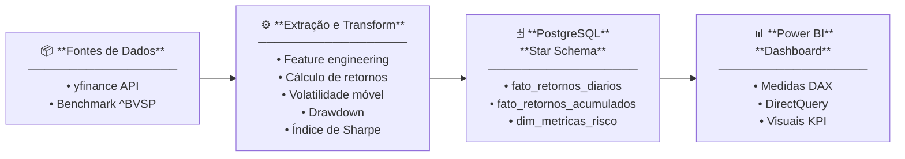

# 📊 Portfolio Financial Analytics

> **Pipeline completo de engenharia de dados para análise de performance de carteira de investimentos vs. Ibovespa**

[](https://www.python.org/)
[](https://www.postgresql.org/)
[](https://powerbi.microsoft.com/)

---

## 📌 Visão Geral

Este projeto demonstra um **pipeline completo de engenharia de dados e análise financeira** — da extração de dados brutos de mercado até um dashboard interativo no Power BI — aplicado ao mercado de capitais brasileiro.

O pipeline avalia a performance de uma carteira multi-ativo contra o benchmark **Ibovespa (^BVSP)**, calculando métricas ajustadas ao risco como **Índice de Sharpe**, **volatilidade móvel** e **drawdown**.

> Projeto desenvolvido para construção de uma camada analítica de acompanhamento de performance e risco de investimentos.

---

## 🏗️ Arquitetura



---

## 🚀 Funcionalidades

- **Extração automatizada** via `yfinance` para ações brasileiras e o índice Ibovespa (benchmark)
- **Feature engineering**: retorno diário, retorno acumulado, volatilidade móvel de 21 dias (anualizada), Índice de Sharpe e drawdown a partir do pico
- **Modelo Star Schema** no PostgreSQL com views analíticas pré-calculadas
- **Queries SQL analíticas** com window functions (`STDDEV_POP`, `MAX` running, CTE)
- **Dashboard no Power BI** com conexão híbrida DirectQuery/Import e medidas DAX para análise interativa

---

## 📁 Estrutura do Projeto

```
portfolio-financial-analytics/
│
├── data/
│   ├── fato_retornos_diarios.csv
│   ├── fato_retornos_acumulados.csv
│   └── dim_metricas_risco.csv
│
├── notebooks/
│   ├── extract_transform.ipynb
│   └── load_postgres.ipynb
│
├── sql/
│   └── analytical_queries.sql
│
├── README.md
├── requirements.txt
└── .gitignore
```

---

## 🗄️ Modelo de Dados (Star Schema)

```
                    ┌──────────────────────────┐
                    │   dim_metricas_risco     │
                    │──────────────────────────│
                    │  ativo (PK)              │
                    │  sharpe_ratio            │
                    │  volatilidade_anual      │
                    │  max_drawdown            │
                    │  retorno_total           │
                    └──────────┬───────────────┘
                               │
          ┌────────────────────┼────────────────────┐
          │                                         │
┌─────────▼──────────────┐           ┌──────────────▼──────────────┐
│  fato_retornos_diarios │           │  fato_retornos_acumulados   │
│────────────────────────│           │─────────────────────────────│
│  date                  │           │  date                       │
│  ativo                 │           │  ativo                      │
│  retorno_diario        │           │  retorno_acumulado          │
│  volatilidade_mov_21d  │           │  retorno_acumulado_pct      │
└────────────────────────┘           └─────────────────────────────┘
```

---

## 📈 Métricas Calculadas

| Métrica | Descrição | Método |
|---|---|---|
| **Retorno Diário** | Variação percentual dia a dia | `pct_change()` |
| **Retorno Acumulado** | Retorno total composto desde o início | `(1 + r).cumprod() - 1` |
| **Volatilidade Móvel** | Desvio padrão anualizado de 21 dias | `STDDEV_POP` window × √252 |
| **Índice de Sharpe** | Retorno ajustado ao risco vs. CDI | `(Rp - Rf) / σp` |
| **Drawdown** | Queda a partir do pico histórico | Window function `MAX` running |

---

## 📌 Principais Insights

🏆 Performance
- PETR4 foi o ativo de maior destaque da carteira, acumulando +407,65% em 5 anos.
- SBSP3 também apresentou excelente desempenho, com +278,57% de retorno acumulado.
- O Ibovespa acumulou +42,56% no mesmo período.

⚖️ Eficiência Risco-Retorno
- PETR4 apresentou o melhor Sharpe Ratio (0,86), indicando a melhor relação entre retorno e risco dentre os ativos analisados.
- O resultado sugere que o retorno obtido compensou adequadamente a volatilidade assumida pelo investidor.
  
📈 Risco
- B3SA3 apresentou a maior volatilidade anualizada da carteira (36,45%), indicando maior sensibilidade às oscilações de mercado.
- Em contrapartida, o ativo também registrou o pior desempenho absoluto da carteira (-7,33%).
  
📉 Preservação de Capital
- O maior drawdown ocorreu em B3SA3 (-49,92%), significando que o ativo perdeu quase metade do seu valor entre um pico e o fundo subsequente.
- ITSA4 apresentou o menor drawdown (-25,63%), demonstrando maior resiliência durante períodos de estresse de mercado.
  
🎯 Benchmark
- A carteira apresentou retorno médio de 107,45%, contra 42,56% do Ibovespa.
- Isso representa um Alpha de +64,89 pontos percentuais, indicando geração significativa de valor acima do benchmark.

  ## 📊 Tabela Executiva

| Indicador | Resultado |
|------------|------------|
| Melhor Retorno Acumulado | PETR4 (+407,65%) |
| Melhor Sharpe Ratio | PETR4 (0,86) |
| Maior Volatilidade | B3SA3 (36,45%) |
| Maior Drawdown | B3SA3 (-49,92%) |
| Menor Drawdown | ITSA4 (-25,63%) |
| Retorno da Carteira | +107,45% |
| Retorno Ibovespa | +42,56% |
| Alpha da Carteira | +64,89 p.p. |

>Período analisado: 01/01/2021 a 05/06/2026 - Horizonte: 5 anos

---

## 🔧 Configuração e Instalação

### Pré-requisitos

- Python 3.10+
- PostgreSQL 15+
- Power BI Desktop (para o dashboard)

### 1. Clonar o repositório

```bash
git clone https://github.com/ric-moreno/portfolio-financial-analytics.git
cd portfolio-financial-analytics
```

### 2. Criar ambiente virtual e instalar dependências

```bash
python -m venv venv
source venv/bin/activate  # No Windows: venv\Scripts\activate
pip install -r requirements.txt
```

> **Principais bibliotecas:** `yfinance`, `pandas`, `numpy`, `psycopg2`, `python-dotenv`, `requests`

### 3. Configurar variáveis de ambiente

Crie um arquivo `.env` na raiz do projeto (nunca faça commit deste arquivo):

```env
DB_HOST=localhost
DB_PORT=5432
DB_NAME=financial_analytics
DB_USER=seu_usuario
DB_PASSWORD=sua_senha
```

### 4. Criar o banco de dados no PostgreSQL

```sql
CREATE DATABASE financial_analytics;
CREATE SCHEMA financial_analytics;
```

### 5. Executar os notebooks na ordem

```
1. extract_transform.ipynb   → Extrai, limpa e gera as features
2. load_postgres.ipynb       → Cria o schema e carrega os dados no PostgreSQL
```

### 6. Executar as queries analíticas

Abra o arquivo `analytical_queries.sql` no seu cliente SQL (DBeaver, pgAdmin, etc.) para explorar as queries com window functions para drawdown e volatilidade móvel.

---

## 📊 Dashboard Power BI

O dashboard conecta ao PostgreSQL via **DirectQuery** (dados em tempo real) com uma camada **Import** para agregações computadas.

**Medidas DAX incluídas:**

```dax
-- Retorno Acumulado
Retorno Acumulado = CALCULATE(SUM(fato_retornos_acumulados[retorno_acumulado_pct]))

-- Volatilidade Anualizada
Volatilidade Anual = AVERAGE(fato_retornos_diarios[volatilidade_mov_21d]) * SQRT(252)

-- Índice de Sharpe
Sharpe Ratio = DIVIDE([Retorno Acumulado] - [CDI_Acumulado], [Volatilidade Anual])

-- Alpha vs Ibovespa
Alpha = [Retorno_Portfolio] - [Retorno_BVSP]
```

---

## 🧠 Contexto Financeiro

Projeto contextualizado no **mercado de capitais brasileiro**:

- **Benchmark:** Ibovespa (^BVSP) — principal índice de ações do Brasil
- **Ativos analisados:** 10 ações mais representativas do Índice IBovespa: VALE3, ITUB4, PETR4,	BBAS3, BBDC4, SBSP3, B3SA3, ITSA4, ABEV3, WEGE3

> O conhecimento do domínio financeiro é embasado pela certificação **CEA (Certificação de Especialista em Investimentos ANBIMA)**, garantindo a correta interpretação e aplicação das métricas financeiras.

---

## 🛠️ Stack Tecnológica

| Camada | Tecnologia |
|---|---|
| Extração de Dados | Python, `yfinance` |
| Transformação | `pandas`, `numpy`, Jupyter Notebooks |
| Armazenamento | PostgreSQL 15 (Star Schema) |
| SQL Analítico | Window functions, CTEs, views pré-calculadas |
| Visualização | Power BI (DirectQuery + DAX) |
| Controle de Versão | Git / GitHub |

---

## 👤 Autor

**Pedro Ricardo Moreno**  
Data Analyst | Financial Analytics | CEA — ANBIMA

[](https://github.com/ric-moreno)
